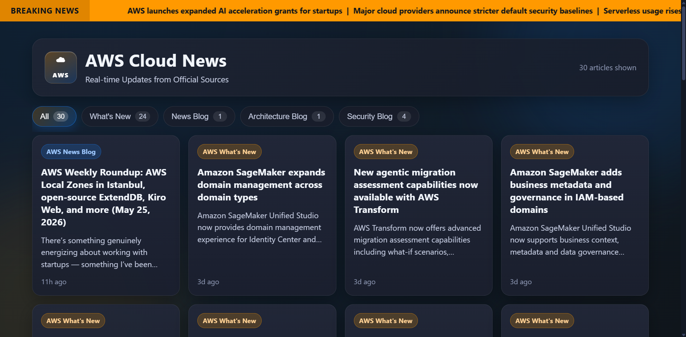

# ☁️ AWS Cloud News Dashboard


---
## 📱 Interface Preview



A premium, dark-themed SaaS dashboard designed to elegantly aggregate live cloud computing feeds.
## 💡 Project Overview
The **AWS Cloud News Dashboard** solves a common problem for cloud engineers: keeping up with the rapid pace of AWS updates. Instead of manually checking multiple blogs and RSS feeds, this platform consolidates everything into a unified interface.

### The Innovation: Autonomous Dev Workflows
What makes this project unique isn't just the code—it's **how it was built and how it maintains itself**. Rather than relying on traditional manual coding or heavy backend servers, it uses **Oz cloud-hosted AI agents** to parallelize feature builds and handle automated, headless data refreshes completely on autopilot.

---

## 🛠️ Architecture & Core Components

| Component | Technology | Purpose / Implementation |
| :--- | :--- | :--- |
| **Frontend UI** | HTML5, Vanilla JS, CSS3 | Clean, responsive dark-mode SaaS dashboard with custom smooth animations and scrollbars. |
| **Data Scraping Engine** | Node.js (`rss-parser`) | Asynchronously fetches 4 official AWS RSS feeds in parallel, deduplicates items, and updates the local dataset. |
| **Cloud Orchestration** | Oz by Warp | Runs remote, headless cloud environments to host the autonomous daily scheduler. |
| **CI/CD Pipeline** | GitHub Actions | Automatically triggers on repository pushes to rebuild and deploy the static site to GitHub Pages. |

---

## 🤖 Oz Agent Workflows (How It Was Built)

### 1. Parallel Task Execution
Instead of building everything locally and throttling machine performance, multiple tasks were offloaded to parallel cloud agents:
* **UI/UX Construction:** A local agent generated the core dashboard skeleton and CSS layout.
* **Feature Parallelism:** A remote cloud agent was spun up via `oz agent run-cloud` to design and integrate the sliding marquee breaking news ticker.
* **Security Guardrails:** A simultaneous cloud agent ran a pipeline audit of `fetch-news.js` to flag vulnerabilities and generate a `SECURITY.md` report.

### 2. The Autopilot Switch (Daily Scheduling)
To keep the dashboard evergreen, a headless cron-schedule agent was deployed directly to the Oz cloud cluster:
```powershell
oz schedule create --name "aws-news-daily-updater" --cron "0 0 * * *" --environment <YOUR_ENVIRONMENT_ID> --prompt "Run the update script. If there is new news, push it to GitHub."
